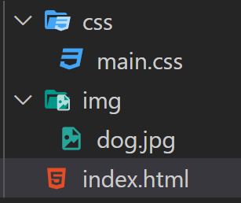
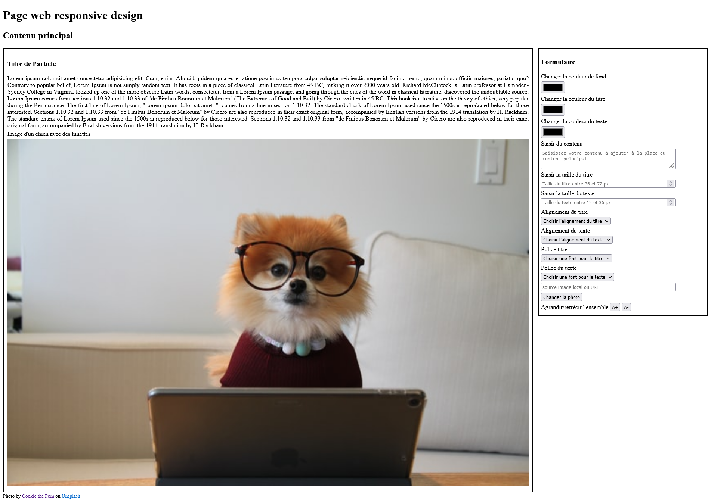
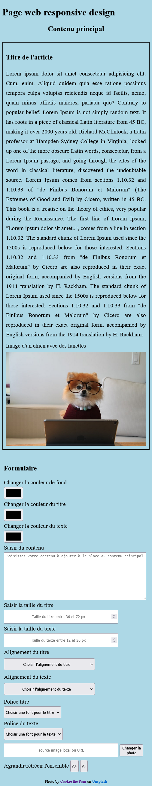
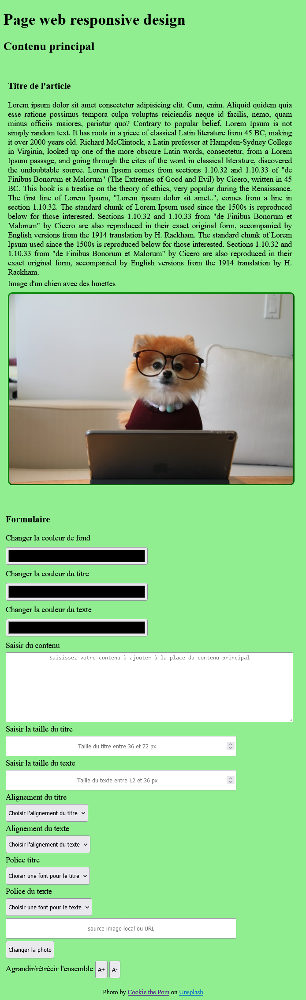

# TP : Application cours HTML/CSS

## Objectifs du TP

1. Travailler à plusieurs sur le même dépôt git.
2. Créez des pages web responsives en utilisant les langages HTML/CSS.

## Contexte globale du TP

Reproduire les pages web à partir des maquettes et en respectant les exigences techniques et les contraintes organisationnelles.

### Travail à réaliser

1. Un membre du groupe, crée un projet GitHub et invite les autres membres du groupe à collaborer sur ce projet. 
2. **Tous les membres du groupe travaillent ensemble pour créer rapidement *uniquement le HTML* qui sera la base du TP**
3. Après avoir fini le HTML en groupe, vous devez faire la mise en page de la page Web pour les versions Desktop (bureau), mobile et tablette.
- Pour les mises en page, le groupe s'auto-organise pour assigner les tâches aux membres du groupe.
- Vous pouvez être amené à travailler seul ou en pair-programming pour satisfaire la tâche.

### Ressources

- [Lorem Ipsum](https://www.lipsum.com/) (texte de remplissage à copier/coller sur votre page HTML)
- Images gratuites et libre de droit à condition de citer l'auteur [unsplash](https://unsplash.com/)
- Validation du code HTML à l'aide de [HTML Validator]() (copiez/collez votre code HTML)
- Validation du code CSS à l'aide de [CSS Validator]() (copiez/collez votre code CSS)

### Exigences techniques

1. Un dépôt GitHub par groupe.
2. 5 branches distinctes et spécifiques à chaque tâche :
- main (par défaut).
- feature/html (pour la page html).
- feature/css-desktop (pour la mise en page du CSS en version bureau).
- feature/css-mobile (pour la mise en page du CSS en version mobile).
- feature/css-tablet (pour la mise en page du CSS en version tablette).
3. Arborescence du projet à respecter.
- 
4. *Tout le css du projet doit être réalisé dans le fichier `main.css`, tous les membres du projet travail sur ce fichier à partir de leur branche dédiée.*
5. Aucun conflit sur le dépôt distant (résolvez les conflits en local et en communiquant avec votre équipe)
6. Code HTML valide.
7. Code CSS valide.
8. **Restez fidèle par rapport à la maquette sans perdre du temps à essayer d'être le plus précis possible (je ne vous demande pas de positionner les éléments au pixel près).**

### Précisions techniques

#### Éléments à intégrer pour la branche feature/html

##### Bloc de gauche

1. Un titre de niveau 1.
2. Du texte, copiez/collez du [Lorem ipsum](https://www.lipsum.com/).
3. Une image, image du chien à récupérer [ici](https://unsplash.com/photos/siNDDi9RpVY)

##### Bloc de droite

1. Un label "changer la couleur de fond" et un champ de type *color*.
2. Un label "changer la couleur du titre" et un champ de type *color*.
3. Un label "changer la couleur du texte" et un champ de type *color*.
4. Un label "saisir du contenu" et un champ *textarea*.
5. Un label "saisir la taille du titre" et un champ de type *number*, taille comprise entre *36px* et *72px*, utilisez les attributs *min="36"* et *max="72"* sur le champ.

6. Un label "saisir la taille du texte" et un champ de type number, taille comprise entre *12px* et *36px*.
7. Un label "alignement du titre" et une sélection d'élément avec les options droite, gauche, centré et justifié.
8. Un label "alignement du texte" avec un sélection d'élément ayant les options droite, gauche, centré et justifié.
9. Un label "police du texte" avec une sélection  de fonts (polices) avec les options arial, sans-serif, serif, roboto, monospace, cursive, fantasy. 

#### Maquette de la page version desktop (bureau) pour la branche feature/css-desktop

#### Maquette de la page version mobile pour la branche feature/css-mobile

#### Maquette de la page version tablette pour la branche feature/css-tablet

